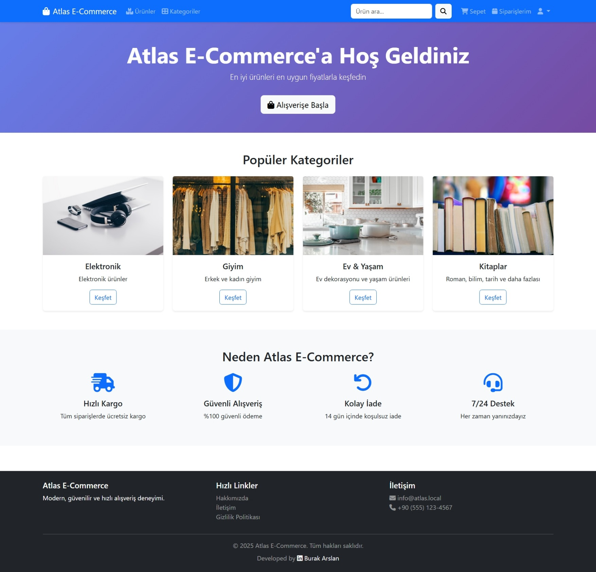
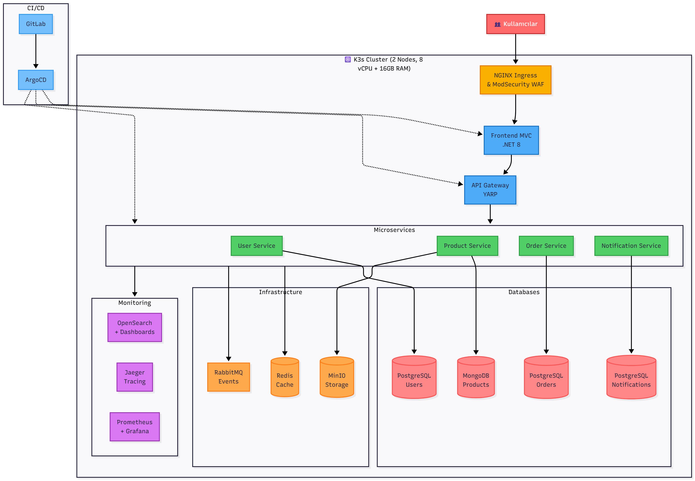
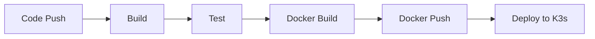

# 🛒 Atlas E-Commerce Platform - Mikroservis Mimarisi Dönüşümü



> **⚠️ ÖNEMLİ:** Bu proje, Türk Telekom Bulut Bilişim Kampı Final Projesi kapsamında geliştirilmiş bir **DEMO uygulamasıdır**. Eğitim ve öğrenme amaçlıdır.

[](https://dotnet.microsoft.com/)
[](https://www.docker.com/)
[](LICENSE)

## 📋 İçindekiler

- [Proje Hakkında](#-proje-hakkında)
- [Mimari](#-mimari)
- [Kullanılan Teknolojiler](#-kullanılan-teknolojiler)
- [Dosya Yapısı](#-dosya-yapısı)
- [Önkoşullar](#-önkoşullar)
- [Kurulum ve Çalıştırma](#-kurulum-ve-çalıştırma)
- [Servisler ve Portlar](#-servisler-ve-portlar)
- [Özellikler](#-özellikler)
- [Ekran Görüntüleri](#-ekran-görüntüleri)
- [CI/CD Pipeline](#-cicd-pipeline)
- [Geliştirme](#-geliştirme)
- [Katkıda Bulunanlar](#-katkıda-bulunanlar)

---

## 🎯 Proje Hakkında

### Problem Tanımı

**Atlas**, Türkiye'nin en çok kullanılan e-ticaret platformlarından biri olarak milyonlarca aktif kullanıcıya sahip. Platform, yıllar önce **monolitik bir mimari** ile geliştirilmiş ve o dönemlerde kullanıcı sayısı düşük olduğu için sistem ihtiyaçları karşılayabiliyordu. Ancak son yıllarda artan trafik, yoğun kampanya dönemleri ve genişleyen ürün kataloğu, mevcut altyapının sınırlarını zorlamaya başladı.

### Karşılaşılan Sorunlar

1. **Performans Sorunları**
   - Kampanya saatlerinde sistem yükü kaldıramıyor, kullanıcılar hata sayfalarıyla karşılaşıyor
   - Bazı istekler 5-7 saniye içinde yanıtlanıyor
   - Özellikle ödeme adımlarında yaşanan yavaşlık, sepet terk oranlarını ciddi şekilde artırıyor

2. **Güvenlik Riskleri**
   - Zaman zaman bot login girişleri tespit ediliyor
   - Bu saldırılar hem performans hem de güvenlik açısından tehdit oluşturuyor

3. **Operasyonel Zorluklar**
   - Deployment süreçleri çok uzun sürüyor (küçük bir değişiklik bile saatler alıyor)
   - Sorun çıktığında uygulamayı yeniden başlatmak uzun zaman alıyor
   - Legacy ortam nedeniyle kaynak artırımı hızlı yapılamıyor
   - Sistemin performansını anlık olarak izlemek mümkün değil

4. **Uyumluluk ve Regülasyon**
   - KVKK ve GDPR gibi regülasyonlara uyum sağlanması gerekiyor
   - Eski yapı bu gereksinimleri karşılamakta yetersiz kalıyor

5. **Geliştirme Süreçleri**
   - Farklı geliştirme ekipleri (UI/UX, frontend, backend) kendi lokal ortamlarında bağımsız çalıştığı için versiyon karmaşası yaşanıyor
   - Test süreçleri verimsiz ilerliyor
   - Uygulama yapıları arasında yedeklilik eksikliği büyük bir risk oluşturuyor

### Çözüm: Bulut Tabanlı Mikroservis Mimarisi

Bu proje, monolitik Atlas uygulamasının **modern bulut tabanlı mikroservis mimarisine** dönüşümünü simüle etmektedir.

#### Proje Rolleri

Bu projede **Operasyon** ve **Geliştirici** şapkaları takınılarak:

- **🔧 Operasyon Rolü:** Sistemin altyapı ve platform operasyon işlemlerini gerçekleştirdim
  - Docker containerization
  - CI/CD pipeline kurulumu (GitLab CI)
  - Monitoring ve logging altyapısı (OpenSearch, Jaeger)
  - Güvenlik katmanları (ModSecurity WAF, Rate Limiting)

- **💻 Geliştirici Rolü:** Mikroservis mimarisini tasarlayıp geliştirdim
  - RESTful API servisleri
  - Event-driven architecture (RabbitMQ)
  - Distributed caching (Redis)
  - API Gateway pattern
  - Frontend uygulaması

---

## 🏗️ Mimari

### Mimari Diyagram



### Mimari Bileşenler

#### 1. **Frontend Katmanı**
- **NGINX + ModSecurity WAF:** Kullanıcı isteklerini karşılayan, güvenlik duvarı özelliklerine sahip yük dengeleyici
- **Frontend MVC (.NET 8):** ASP.NET Core Razor Pages ile geliştirilmiş kullanıcı arayüzü

#### 2. **API Gateway Katmanı**
- **API Gateway (YARP):** Tüm mikroservislere tek giriş noktası, routing ve load balancing

#### 3. **Mikroservis Katmanı**

##### User Service (Kullanıcı Yönetimi)
- Kullanıcı kayıt, giriş ve profil yönetimi
- JWT tabanlı authentication
- PostgreSQL veritabanı
- Redis cache

##### Product Service (Ürün Yönetimi)
- Ürün kataloğu ve kategori yönetimi
- MongoDB veritabanı
- MinIO object storage (ürün görselleri)
- OpenSearch ile arama

##### Order Service (Sipariş Yönetimi)
- Sepet ve sipariş işlemleri
- PostgreSQL veritabanı
- Event-driven sipariş akışı

##### Notification Service (Bildirim Yönetimi)
- Email ve SMS bildirimleri
- PostgreSQL veritabanı
- Event consumer (RabbitMQ)

#### 4. **Altyapı Bileşenleri**

##### Veritabanları
- **PostgreSQL (3 Instance):** User, Order ve Notification servisleri için
- **MongoDB:** Product servisi için (NoSQL, esnek şema)
- **Redis:** Distributed cache ve session yönetimi

##### Mesajlaşma ve Event Bus
- **RabbitMQ:** Event-driven architecture, asenkron iletişim

##### Storage
- **MinIO:** S3-compatible object storage, ürün görselleri

##### Monitoring ve Logging
- **OpenSearch + Dashboards:** Merkezi log toplama ve analiz
- **Jaeger:** Distributed tracing
- **Prometheus + Grafana:** (Planlanan) Metrics ve monitoring

#### 5. **CI/CD ve Deployment**
- **GitLab CI:** Otomatik build, test, docker build ve push
- **ArgoCD:** (Planlanan) GitOps deployment
- **K3s Cluster:** Kubernetes ortamı (2 node, 8 vCPU + 16GB RAM)

### Monolitik vs Mikroservis Karşılaştırması

| Özellik | Monolitik (Eski) | Mikroservis (Yeni) |
|---------|-----------------|-------------------|
| **Deployment** | Tüm sistem birlikte deploy | Servisler bağımsız deploy |
| **Ölçeklenebilirlik** | Tüm sistem birlikte scale | Her servis bağımsız scale |
| **Teknoloji Stack** | Tek teknoloji | Her servis farklı DB kullanabilir |
| **Hata İzolasyonu** | Bir hata tüm sistemi etkiler | Hatalar servise özel |
| **Geliştirme Hızı** | Yavaş (bağımlılıklar) | Hızlı (bağımsız ekipler) |
| **Database** | Tek DB | Her servis kendi DB'si |
| **API Response Time** | 5-7 saniye | <500ms (hedef) |

---

## 🛠️ Kullanılan Teknolojiler

### Backend
- **.NET 8.0** - Mikroservis framework'ü
- **C# 12** - Programlama dili
- **ASP.NET Core Web API** - RESTful API'ler
- **Entity Framework Core** - ORM (PostgreSQL için)
- **MongoDB.Driver** - MongoDB client
- **YARP (Yet Another Reverse Proxy)** - API Gateway
- **RabbitMQ.Client** - Message broker client
- **StackExchange.Redis** - Redis client
- **Jaeger .NET Client** - Distributed tracing
- **Serilog** - Structured logging

### Frontend
- **ASP.NET Core MVC / Razor Pages** - Web UI
- **Bootstrap 5** - CSS framework
- **JavaScript / jQuery** - Client-side scripting

### Veritabanları
- **PostgreSQL 15** - Relational database (User, Order, Notification)
- **MongoDB 7** - Document database (Product)
- **Redis 7** - In-memory cache

### Infrastructure
- **Docker & Docker Compose** - Containerization
- **NGINX + ModSecurity** - Web server + WAF
- **RabbitMQ** - Message broker
- **MinIO** - Object storage
- **OpenSearch 2.11** - Search and analytics
- **OpenSearch Dashboards** - Log visualization
- **Jaeger** - Distributed tracing

### CI/CD
- **GitLab CI** - Continuous Integration
- **Docker Registry** - Container registry
- **K3s** - Lightweight Kubernetes

---

## 📁 Dosya Yapısı

```
Atlas_Project/
│
├── src/                                    # Kaynak kod klasörü
│   ├── ApiGateway/                        # YARP API Gateway
│   │   ├── Program.cs
│   │   ├── appsettings.json               # Gateway routing config
│   │   └── Dockerfile
│   │
│   ├── UserService/                       # Kullanıcı mikroservisi
│   │   ├── Controllers/
│   │   │   ├── AuthController.cs          # Login, Register
│   │   │   └── UserController.cs          # Profile operations
│   │   ├── Data/
│   │   │   ├── ApplicationDbContext.cs
│   │   │   └── Entities/
│   │   ├── Services/
│   │   ├── Program.cs
│   │   └── Dockerfile
│   │
│   ├── ProductService/                    # Ürün mikroservisi
│   │   ├── Controllers/
│   │   │   ├── CategoryController.cs
│   │   │   └── ProductController.cs
│   │   ├── Data/
│   │   │   ├── MongoDbContext.cs
│   │   │   └── Models/
│   │   ├── Services/
│   │   │   ├── IMinioService.cs           # Object storage
│   │   │   └── ISearchService.cs          # OpenSearch
│   │   ├── Program.cs
│   │   └── Dockerfile
│   │
│   ├── OrderService/                      # Sipariş mikroservisi
│   │   ├── Controllers/
│   │   │   ├── CartController.cs
│   │   │   └── OrderController.cs
│   │   ├── Data/
│   │   │   ├── OrderDbContext.cs
│   │   │   └── Entities/
│   │   ├── Services/
│   │   │   └── IEventPublisher.cs         # RabbitMQ publisher
│   │   ├── Program.cs
│   │   └── Dockerfile
│   │
│   ├── NotificationService/               # Bildirim mikroservisi
│   │   ├── Consumers/                     # RabbitMQ consumers
│   │   │   ├── OrderCreatedConsumer.cs
│   │   │   └── UserRegisteredConsumer.cs
│   │   ├── Services/
│   │   │   ├── IEmailService.cs
│   │   │   └── ISmsService.cs
│   │   ├── Program.cs
│   │   └── Dockerfile
│   │
│   ├── Frontend/                          # Web arayüzü
│   │   ├── Controllers/
│   │   │   ├── HomeController.cs
│   │   │   ├── AccountController.cs
│   │   │   ├── ProductController.cs
│   │   │   ├── CartController.cs
│   │   │   └── OrderController.cs
│   │   ├── Views/
│   │   │   ├── Home/
│   │   │   ├── Account/
│   │   │   ├── Product/
│   │   │   ├── Cart/
│   │   │   ├── Order/
│   │   │   └── Shared/
│   │   ├── wwwroot/                       # Static files
│   │   ├── Program.cs
│   │   └── Dockerfile
│   │
│   ├── Common/                            # Shared libraries
│   │   ├── Atlas.Common/
│   │   │   ├── Events/                    # Event models
│   │   │   ├── DTOs/                      # Data transfer objects
│   │   │   ├── Middleware/
│   │   │   │   ├── ExceptionMiddleware.cs
│   │   │   │   └── RateLimitMiddleware.cs
│   │   │   └── Extensions/
│   │   └── Atlas.Tracing/                 # Jaeger tracing
│   │
│   └── UserService.Tests/                 # Unit tests
│       └── ...
│
├── nginx/                                  # NGINX configuration
│   └── atlas-lb.conf                      # Load balancer + WAF config
│
├── scripts/                                # Initialization scripts
│   └── mongo-init.js                      # MongoDB init script
│
├── k8s/                                    # (Opsiyonel) Kubernetes manifests
│   ├── infrastructure/
│   ├── services/
│   └── ingress/
│
├── docker-compose.yml                      # Ana compose file
├── .gitlab-ci.yml                          # CI/CD pipeline
├── Atlas.sln                               # Solution file
├── Atlas_Project_Architecture.png          # Mimari diyagram
├── Atlas_DEMO.jpeg                         # UI screenshot
├── .gitignore
└── README.md                               # Bu dosya
```

---

## ✅ Önkoşullar

Projeyi çalıştırmak için sisteminizde aşağıdaki yazılımlar kurulu olmalıdır:

- **Docker Desktop**: 4.25+ (Windows/Mac) veya Docker Engine 24+ (Linux)
- **Docker Compose**: 2.20+
- **Git**: 2.40+
- **.NET SDK 8.0+** (Opsiyonel - sadece local development için)
- **En az 8GB RAM** (16GB önerilir)
- **En az 20GB disk alanı**

### Sistem Gereksinimleri

```
CPU: 4 core (8 core önerilir)
RAM: 8 GB minimum (16 GB önerilir)
Disk: 20 GB boş alan
OS: Windows 10/11, macOS 11+, Linux (Ubuntu 20.04+)
```

---

## 🚀 Kurulum ve Çalıştırma

### 1. Projeyi Klonlayın

```bash
git clone https://github.com/username/atlas-project.git
cd atlas-project
```

### 2. Ortam Değişkenlerini Yapılandırın

`docker-compose.yml` dosyasında aşağıdaki değerleri kendi bilgilerinizle değiştirin:

#### Zorunlu Yapılandırmalar
- **Twilio SMS Ayarları** (notification-service bölümünde):
  - `Sms__AccountSid`: Twilio hesap SID'nizi girin
  - `Sms__AuthToken`: Twilio auth token'ınızı girin
  - `Sms__FromPhoneNumber`: Twilio telefon numaranızı girin
  - Not: SMS özelliğini kullanmak istemiyorsanız `Sms__Enabled=false` yapabilirsiniz

#### Production İçin Önerilen Değişiklikler
- Veritabanı şifreleri
- JWT secret key
- RabbitMQ credentials
- MinIO access keys
- SMTP ayarları (email gönderimleri için)

### 3. Docker Compose ile Sistemi Ayağa Kaldırın

#### Tüm Servisleri Başlatma

```bash
docker-compose up -d
```

Bu komut şunları yapacaktır:
1. Tüm container image'larını indirir (ilk çalıştırmada ~5-10 dakika sürer)
2. .NET servislerini build eder
3. Veritabanlarını başlatır ve initialize eder
4. Tüm mikroservisleri başlatır
5. Health check'lerin geçmesini bekler

#### Logları İzleme

Tüm servislerin loglarını görmek için:

```bash
docker-compose logs -f
```

Belirli bir servisin logunu görmek için:

```bash
docker-compose logs -f user-service
docker-compose logs -f product-service
docker-compose logs -f order-service
```

#### Servislerin Durumunu Kontrol Etme

```bash
docker-compose ps
```

Çıktı şu şekilde olmalıdır (tüm servisler `Up (healthy)` durumda):

```
NAME                              STATUS
atlas-postgres-user               Up (healthy)
atlas-postgres-order              Up (healthy)
atlas-postgres-notification       Up (healthy)
atlas-mongodb                     Up (healthy)
atlas-redis                       Up (healthy)
atlas-opensearch                  Up (healthy)
atlas-opensearch-dashboards       Up (healthy)
atlas-rabbitmq                    Up (healthy)
atlas-jaeger                      Up (healthy)
atlas-minio                       Up (healthy)
atlas-user-service                Up
atlas-product-service             Up
atlas-order-service               Up
atlas-notification-service        Up
atlas-apigateway                  Up
atlas-frontend                    Up
atlas-nginx                       Up (healthy)
```

### 4. Uygulamaya Erişim

- **🌐 Ana Web Sitesi**: http://localhost
- **🔧 Admin Dashboard**: http://localhost:8080

### 5. Servisleri Durdurma

```bash
docker-compose down
```

Verileri de silmek için (dikkatli kullanın!):

```bash
docker-compose down -v
```

---

## 🔌 Servisler ve Portlar

### Frontend & Gateway

| Servis | Port | Açıklama | URL |
|--------|------|----------|-----|
| **NGINX (WAF)** | 80, 8080 | Load balancer + ModSecurity | http://localhost |
| **Frontend** | 5004 | Web UI (internal) | http://localhost:5004 |
| **API Gateway** | 5000 | API Gateway (internal) | http://localhost:5000 |

### Mikroservisler

| Servis | Port | Açıklama | Health Check |
|--------|------|----------|--------------|
| **User Service** | 5001 | Kullanıcı yönetimi | http://localhost:5001/health |
| **Product Service** | 5002 | Ürün kataloğu | http://localhost:5002/health |
| **Order Service** | 5003 | Sipariş işlemleri | http://localhost:5003/health |
| **Notification Service** | 5005 | Bildirim gönderimi | http://localhost:5005/health |

### Veritabanları

| Servis | Port | Credentials | Connection |
|--------|------|-------------|------------|
| **PostgreSQL (User)** | 5432 | atlasuser / ChangeThisPassword123! | `Host=localhost;Port=5432;Database=atlas_user` |
| **PostgreSQL (Order)** | 5433 | atlasorder / ChangeThisPassword123! | `Host=localhost;Port=5433;Database=atlas_order` |
| **PostgreSQL (Notification)** | 5434 | atlasnotification / ChangeThisPassword123! | `Host=localhost;Port=5434;Database=atlas_notification` |
| **MongoDB** | 27017 | atlasadmin / ChangeThisPassword123! | `mongodb://localhost:27017` |
| **Redis** | 6379 | (no password) | `localhost:6379` |

### Infrastructure & Monitoring

| Servis | Port | Credentials | URL |
|--------|------|-------------|-----|
| **RabbitMQ Management** | 15672 | atlasuser / ChangeThisPassword123! | http://localhost:15672 |
| **MinIO Console** | 9001 | atlasadmin / ChangeThisPassword123! | http://localhost:9001 |
| **OpenSearch** | 9200 | - | http://localhost:9200 |
| **OpenSearch Dashboards** | 5601 | - | http://localhost:5601 |
| **Jaeger UI** | 16686 | - | http://localhost:16686 |

### Demo Kullanıcılar

Sisteme giriş yapmak için kullanabileceğiniz test kullanıcıları:

```
Email: demo@atlas.local
Password: Demo123!

Email: admin@atlas.local
Password: Admin123!
```

---

## ✨ Özellikler

### Kullanıcı Özellikleri

- ✅ Kullanıcı kayıt ve giriş (JWT authentication)
- ✅ Şifre sıfırlama (email ile)
- ✅ Profil yönetimi
- ✅ Ürün arama ve filtreleme (OpenSearch)
- ✅ Kategori bazlı ürün listeleme
- ✅ Ürün detay sayfası
- ✅ Sepete ekleme / çıkarma
- ✅ Sipariş oluşturma
- ✅ Sipariş geçmişi
- ✅ Email/SMS bildirimleri

### Teknik Özellikler

#### 🔒 Güvenlik
- **ModSecurity WAF**: OWASP Core Rule Set ile güvenlik
- **JWT Authentication**: Stateless auth
- **Rate Limiting**: Brute force koruması
- **Input Validation**: XSS, SQL Injection koruması
- **CORS Policy**: Cross-origin güvenliği

#### ⚡ Performans
- **Redis Caching**: Response time optimizasyonu
- **OpenSearch**: Hızlı ürün araması (full-text search)
- **Connection Pooling**: Database connection yönetimi
- **Async/Await**: Non-blocking I/O operations
- **Load Balancing**: NGINX upstream load balancing

#### 📊 Observability
- **Structured Logging**: Serilog + OpenSearch
- **Distributed Tracing**: Jaeger ile request tracking
- **Health Checks**: Kubernetes-style health endpoints
- **Metrics**: (Planlanan) Prometheus + Grafana

#### 🔄 Resilience
- **Event-Driven Architecture**: RabbitMQ ile loose coupling
- **Circuit Breaker**: (Planlanan) Polly ile fault tolerance
- **Retry Policies**: Transient error handling
- **Database Migrations**: Automatic schema management

#### 🚀 DevOps
- **Containerization**: Tüm servisler Docker container'da
- **CI/CD Pipeline**: GitLab CI ile otomatik build/test/deploy
- **Infrastructure as Code**: Docker Compose + K8s manifests
- **GitOps**: (Planlanan) ArgoCD ile deployment

---

## 📸 Ekran Görüntüleri

### Sistem Mimarisi


**Mimari Açıklaması:**

1. **Kullanıcılar** → İstek gönderir
2. **NGINX + ModSecurity WAF** → Güvenlik kontrolü yapar, zararlı trafiği engeller
3. **Frontend MVC** → Kullanıcı arayüzünü render eder
4. **API Gateway (YARP)** → İstekleri uygun mikroservise yönlendirir
5. **Mikroservisler** → İş mantığını çalıştırır, event publish eder
6. **Veritabanları** → Her servis kendi veritabanını kullanır (database per service pattern)
7. **RabbitMQ** → Servisler arası asenkron iletişim
8. **Redis** → Performans için caching
9. **MinIO** → Ürün görselleri için object storage
10. **Monitoring** → OpenSearch (logs), Jaeger (traces), Prometheus+Grafana (metrics)

### Web Arayüzü


**Özellikler:**

- Responsive tasarım (Bootstrap 5)
- Kategori bazlı ürün gösterimi
- Arama fonksiyonu
- Sepet yönetimi
- Kullanıcı girişi ve kayıt

---

## 🔄 CI/CD Pipeline

Projede **GitLab CI/CD** kullanılarak otomatik build, test ve deployment pipeline'ı kurulmuştur.

### Pipeline Aşamaları



### `.gitlab-ci.yml` Detayları

#### 1. **Build Stage**
```yaml
- dotnet restore
- dotnet build --configuration Release
```
Tüm mikroservisleri build eder, artifact olarak saklar.

#### 2. **Test Stage**
```yaml
- dotnet test --configuration Release
```
Unit testleri çalıştırır, test sonuçlarını raporlar.

#### 3. **Docker Build Stage**
Her mikroservis için paralel olarak Docker image'ları build edilir:
- `atlas/user-service`
- `atlas/product-service`
- `atlas/order-service`
- `atlas/apigateway`
- `atlas/frontend`

#### 4. **Docker Push Stage**
Build edilen image'lar GitLab Container Registry'e push edilir.

#### 5. **Deploy Stage** (Manual)
K3s cluster'a deployment yapılır:
```bash
kubectl apply -f k8s/infrastructure/
kubectl apply -f k8s/services/
kubectl apply -f k8s/ingress/
```

### Trigger Kuralları

- `main` branch'e push → Tüm pipeline çalışır
- `develop` branch'e push → Build ve test çalışır
- Feature branch'ler → Manuel trigger

---

## 💻 Geliştirme

### Local Development (Docker Olmadan)

#### 1. Veritabanlarını Ayağa Kaldırın

```bash
docker-compose up -d postgres-user postgres-order postgres-notification mongodb redis rabbitmq
```

#### 2. Servisleri IDE'de Çalıştırın

Visual Studio veya Rider'da:
1. `Atlas.sln` solution'ını açın
2. `UserService`, `ProductService`, `OrderService` ve `ApiGateway` projelerini "Multiple Startup Projects" olarak ayarlayın
3. F5 ile başlatın

VS Code'da:
```bash
cd src/UserService && dotnet run
cd src/ProductService && dotnet run
cd src/OrderService && dotnet run
cd src/ApiGateway && dotnet run
```

### Yeni Mikroservis Ekleme

1. **Proje Oluşturma**
```bash
dotnet new webapi -n NewService
cd NewService
dotnet add package Npgsql.EntityFrameworkCore.PostgreSQL
dotnet add package StackExchange.Redis
```

2. **Docker Compose'a Ekleme**
```yaml
new-service:
  build:
    context: .
    dockerfile: src/NewService/Dockerfile
  environment:
    - ASPNETCORE_ENVIRONMENT=Development
  ports:
    - "5010:80"
  networks:
    - atlas-network
```

3. **API Gateway'e Route Ekleme**
`src/ApiGateway/appsettings.json`:
```json
{
  "ReverseProxy": {
    "Routes": {
      "new-route": {
        "ClusterId": "new-cluster",
        "Match": {
          "Path": "/api/new/{**catch-all}"
        }
      }
    },
    "Clusters": {
      "new-cluster": {
        "Destinations": {
          "destination1": {
            "Address": "http://new-service:80"
          }
        }
      }
    }
  }
}
```

### Database Migration

#### PostgreSQL (EF Core)

```bash
# User Service
cd src/UserService
dotnet ef migrations add InitialCreate
dotnet ef database update

# Order Service
cd src/OrderService
dotnet ef migrations add InitialCreate
dotnet ef database update
```

#### MongoDB

MongoDB için migration'lar `scripts/mongo-init.js` dosyasında tanımlanır ve container başlangıcında otomatik çalışır.

### Test Yazma

```csharp
// src/UserService.Tests/AuthControllerTests.cs
public class AuthControllerTests
{
    [Fact]
    public async Task Register_ValidUser_ReturnsOk()
    {
        // Arrange
        var mockService = new Mock<IAuthService>();
        var controller = new AuthController(mockService.Object);

        // Act
        var result = await controller.Register(new RegisterRequest { ... });

        // Assert
        Assert.IsType<OkObjectResult>(result);
    }
}
```

Testleri çalıştırma:
```bash
dotnet test
```

---

## 🐛 Sorun Giderme

### Container Başlamıyor

**Sorun:** `docker-compose up` sonrası bazı container'lar hata veriyor.

**Çözüm:**
1. Logları kontrol edin:
   ```bash
   docker-compose logs [service-name]
   ```
2. Container'ı yeniden başlatın:
   ```bash
   docker-compose restart [service-name]
   ```
3. Gerekirse yeniden build edin:
   ```bash
   docker-compose build --no-cache [service-name]
   docker-compose up -d [service-name]
   ```

### Port Çakışması

**Sorun:** `Bind for 0.0.0.0:5432 failed: port is already allocated`

**Çözüm:**
1. Portun kullanımda olup olmadığını kontrol edin:
   ```bash
   # Windows
   netstat -ano | findstr :5432

   # Linux/Mac
   lsof -i :5432
   ```
2. `docker-compose.yml` dosyasında port numarasını değiştirin:
   ```yaml
   ports:
     - "5435:5432"  # Dış port değiştirildi
   ```

### Servisler Arası İletişim Hatası

**Sorun:** User Service, Product Service'e erişemiyor.

**Çözüm:**
1. Network kontrolü:
   ```bash
   docker network ls
   docker network inspect atlas_atlas-network
   ```
2. Service discovery için container isimlerini kullanın (localhost değil):
   ```csharp
   // ❌ Yanlış
   var url = "http://localhost:5002";

   // ✅ Doğru
   var url = "http://product-service:80";
   ```

### Database Connection Hatası

**Sorun:** `Could not connect to database`

**Çözüm:**
1. Database container'ının healthy olduğundan emin olun:
   ```bash
   docker-compose ps postgres-user
   ```
2. Connection string'i kontrol edin:
   ```bash
   docker-compose exec user-service printenv ConnectionStrings__DefaultConnection
   ```
3. Health check'in geçtiğini bekleyin:
   ```bash
   docker-compose logs postgres-user
   ```

### High Memory Usage

**Sorun:** Docker 8GB+ RAM kullanıyor.

**Çözüm:**
1. Kullanılmayan servisleri durdurun:
   ```bash
   docker-compose stop jaeger opensearch-dashboards
   ```
2. Java heap size'ı azaltın (OpenSearch):
   ```yaml
   environment:
     - OPENSEARCH_JAVA_OPTS=-Xms256m -Xmx256m  # 512m yerine
   ```
3. Docker Desktop'ta memory limit ayarlayın:
   Settings → Resources → Memory → 8GB

---

## 📚 Kaynaklar ve Referanslar

### Resmi Dökümanlar
- [.NET 8 Documentation](https://learn.microsoft.com/en-us/dotnet/)
- [Docker Compose Documentation](https://docs.docker.com/compose/)
- [YARP Documentation](https://microsoft.github.io/reverse-proxy/)
- [RabbitMQ .NET Client](https://www.rabbitmq.com/dotnet.html)

### Mikroservis Pattern'leri
- [Microservices.io](https://microservices.io/)
- [API Gateway Pattern](https://microservices.io/patterns/apigateway.html)
- [Database per Service](https://microservices.io/patterns/data/database-per-service.html)
- [Event-Driven Architecture](https://microservices.io/patterns/data/event-driven-architecture.html)

### Blog ve Makaleler
- [Building Microservices with .NET](https://learn.microsoft.com/en-us/dotnet/architecture/microservices/)
- [OWASP ModSecurity Core Rule Set](https://coreruleset.org/)

---

## 🤝 Katkıda Bulunanlar

### Proje Sahibi
- **Burak Arslan** - [GitHub](https://github.com/username)

### Roller
- 🔧 **Operasyon**: Docker containerization, CI/CD, monitoring setup
- 💻 **Geliştirici**: Mikroservis development, API design, frontend

### Teşekkürler
Bu proje, **Türk Telekom Gelişim Üssü** ve **Bulut Bilişim Kampı** kapsamında geliştirilmiştir.

---

## 📝 Lisans ve Notlar

### Lisans
Bu proje bir **demo/eğitim projesidir** ve MIT lisansı altında lisanslanmıştır. Detaylar için `LICENSE` dosyasına bakınız.

---

<div align="center">

**Atlas E-Commerce Platform**

Monolitten Mikrservise: Modern E-Ticaret Altyapısı

⭐ Beğendiyseniz projeye yıldız vermeyi unutmayın!

[📖 Dokümantasyon](#) | [🐛 Sorun Bildir](#) | [💬 Tartışma](#)

</div>
